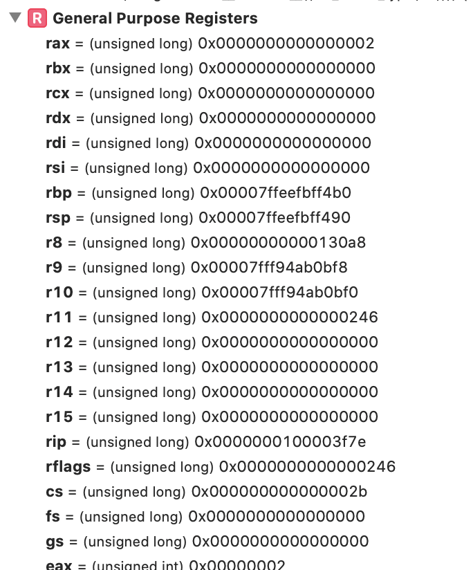
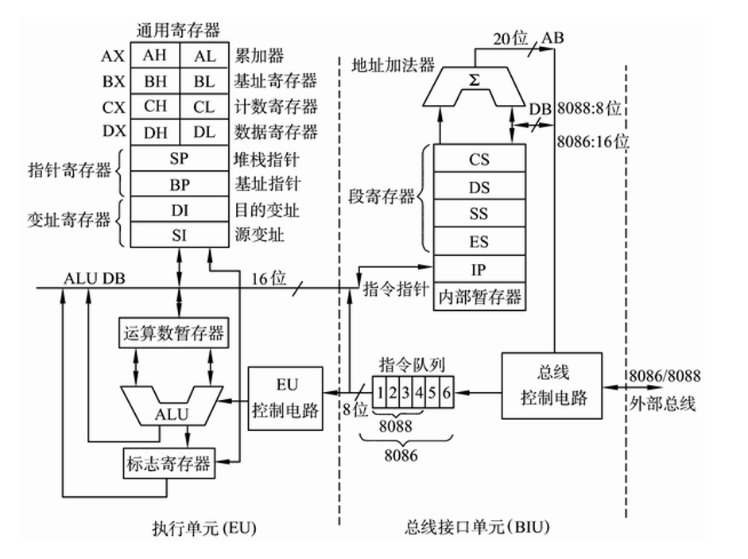

## x86 汇编语言基础知识

### 1.汇编语言能够操作的寄存器
  
- A.12 个通用寄存器
  - RAX RBX RCX RDX 
  - R8 ~ R15
- B.变址寄存器 
  - RSI(Source Index)源变址寄存器
  - RDI(Destinaion Index)目的变址寄存器
- C.栈地址寄存器
  - RBP(Base Address Pointer) 栈基址指针，通常指向栈底
  - RSP(Stack Pointer) 栈顶指针寄存器，指向栈顶位置

- D.标志寄存器
  - RFlag 

- E.6个段寄存器
  - CS (code Segment)
  - DS (data Segment)
  - SS (stack Segment)
  - ES (Extra Segment)
  - GS (Extra Segment)
  - SS (Extra Segment)
- F.程序指针寄存器
  RIP
- G.5个控制寄存器 CR0 ~ CR5
- H. 8个调试寄存器 DR0 ~ DR7
- I. 4个系统地址寄存器 CDTR、IDTR、LDTR、TR
- J. 其他寄存器 TSC

## 2. 值得一提的事，有的资料上只将 RAX、RBX、RCX、RDX 称为通用寄存器，有的资料中将 RAX ~ RDX,RSI\RDI,RBP\RSP,R8~R15统一称为通用寄存器,而在 xcode 的x86_64程序调试中，可以看到通用寄存器的范围更是扩大了.

## 3.各寄存器在 CPU 中的位置和逻辑关系，暂且只找到一张 16位平台下的图

